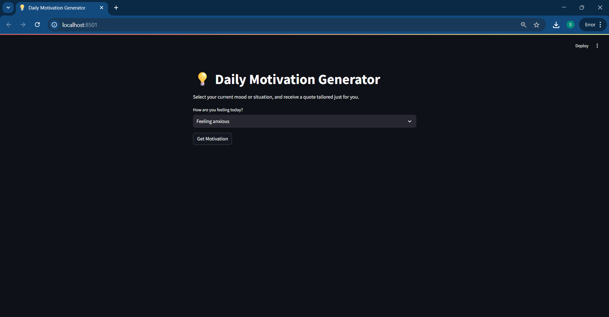
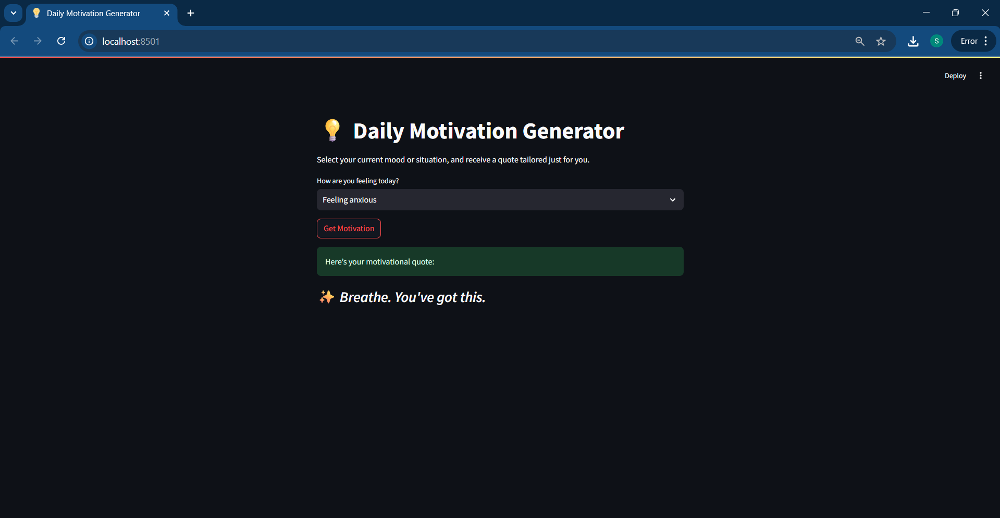

```markdown
# 💡 Daily Motivation Generator

This project is a simple Streamlit app that uses Google's Gemini 1.5 Flash API to generate motivational quotes based on the user's mood or situation.

## 🧠 Features
- Users select how they’re feeling (e.g., "Feeling anxious", "Need focus")
- The app generates a motivational quote using Gemini AI
- Fast and lightweight interface built with Streamlit

## 🚀 How to Run

1. Clone the repository:
   ```bash
   git clone https://github.com/your-username/motivation-generator.git
   cd motivation-generator
   ```

2. Install dependencies:
   ```bash
   pip install -r requirements.txt
   ```

3. Create a `.env` file:
   ```env
   GEMINI_API_KEY=your_google_api_key_here
   ```

4. Run the app:
   ```bash
   streamlit run motivation_app.py
   ```

## 📷 Screenshots

### 🎯 Input Page



### 🌟 Output Quote


## 🔗 Demo
https://dailymotivationappapp-d89jdximvqgh9xejf6duvq.streamlit.app/

---

## 📄 License
MIT License
```
